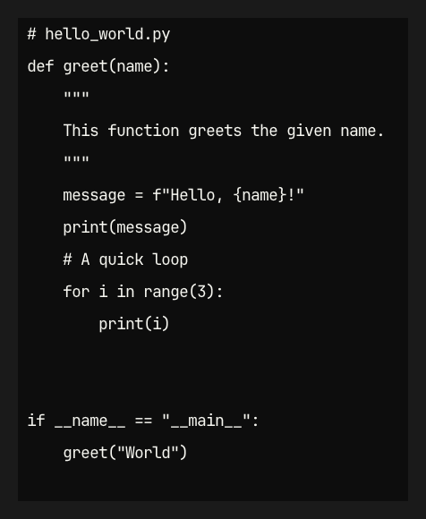

# Code-to-Image Utility

---

## Introduction

The `code-to-image` utility is a lightweight C program designed to convert plain text code snippets into visually appealing image files. This is particularly useful for sharing code on platforms that don't support rich text or syntax highlighting, such as social media, presentations, or simple documentation.

Leveraging the `stb_truetype` library for robust font rendering and `stb_image_write` for image encoding, this tool provides a foundation for creating high-quality code visuals directly from your terminal.

---

## Features

- **Dynamic Font Selection:** Automatically discovers and allows selection of any TrueType Font (`.ttf`) files placed within the `Fonts/` directory and its subdirectories.
- **Customizable Output:** Control the generated image's width, height, and font size.
- **Dark Theme Styling:** Default styling applies a dark background to both the overall image and the code block itself, with vibrant colors for simulated code elements.
- **PNG Output:** Currently outputs images in the high-quality PNG format.

---

## Prerequisites

Before building and running the `code-to-image` utility, ensure you have the following:

- **C Compiler:** A C compiler like GCC or Clang.
- **`stb` Library (Submodule):** The `stb` single-file public domain libraries (specifically `stb_image_write.h` and `stb_truetype.h`) are included as a Git submodule.
  ```bash
  # To get the submodule content after cloning the main repo:
  # git submodule update --init --recursive
  ```
- **TrueType Font (`.ttf`) Files:** Place your desired `.ttf` font files inside a `Fonts/` directory at your project's root. Subdirectories within `Fonts/` will also be searched.
  - **JetBrains Mono:** Available from [https://www.jetbrains.com/lp/mono/](https://www.jetbrains.com/lp/mono/)
  - **Fira Code:** Available from [https://github.com/tonsky/FiraCode](https://github.com/tonsky/FiraCode)

---

## Cloning the Repository (with Submodules)

Since this repository uses Git submodules for the `stb` library, you'll need an extra step after cloning to ensure you have all the necessary files:

```bash
git clone [https://github.com/Harshit-Dhanwalkar/Code-to-image](https://github.com/Harshit-Dhanwalkar/Code-to-image)
cd Code-to-image
# Initialize and update the submodule (stb library)
git submodule update --init --recursive
```

---

## Building

Navigate to your project's root directory in the terminal and compile the `code-to-image.c` file using GCC. Remember to link the math library (`-lm`).

```bash
gcc -Wall -Wextra -g \
    -I. \
    -I./stb \
    code-to-image.c \
    -o code-to-image \
    -lm
```

---

## Usage

After successful compilation, you can run the executable from your terminal.

### Basic Usage

By default, it will use the first font it finds in the `Fonts/` directory, a default size of 800x600 pixels, and an 18.0px font height, saving the output to `highlighted_code.png`.

```bash
./code-to-image
```

### Options

- **`-i FILE`**: Input code file to convert (e.g., `my_script.c`). **This is a mandatory option.**
- **`-f FONT_NAME`**: Selects a specific font by its discovered name (e.g., `JetBrainsMono-Regular`, `FiraCode-Regular`). Run `./code-to-image --help` to see a list of available fonts.
- **`-fs SIZE`**: Sets the font size in pixels (e.g., `-fs 24`).
- **`-w WIDTH`**: Sets the image width in pixels (default: calculated based on content, or 200 if no content).
- **`-h HEIGHT`**: Sets the image height in pixels (default: calculated based on content, or 100 if no content).
- **`OUTPUT_PATH.png`**: (Positional argument) Specifies the output filename and path for the image (e.g., `my_custom_code.png`). If omitted, defaults to `highlighted_code.png`.
- **`--help` or `-u`**: Displays the usage information and a list of all detected fonts.

### Examples

**1. Generate an image from a Python script with JetBrains Mono font:**

First, create a sample Python file (e.g., `examples/test.py`):

```python
# examples/test.py
def greet(name):
    """
    This function greets the given name.
    """
    message = f"Hello, {name}!"
    print(message)
    # A quick loop
    for i in range(3):
        print(i)

if __name__ == "__main__":
    greet("World")
    # End of script
```

Then, run the `code-to-image` utility:

```bash
./code-to-image examples/output.png -i examples/test.py -f JetBrainsMono-Regular -fs 20 -w 800 -h 400
```

This command will read `examples/test.py`, render its content using the `JetBrainsMono-Regular` font at 20px size, and save the output to `examples/output.png`. The image will have a width of 800 pixels and a height of 400 pixels.

**Expected Output Image (Conceptual, without actual syntax highlighting yet):**



The image will display the Python code with a dark background and white text, automatically sized to fit the content if `-w` and `-h` are not explicitly set (or constrained by them if they are).

**2. Generate an image with a specific font and custom size:**

```bash
./code-to-image my_awesome_code.png -i some_code.c -f FiraCode-Regular -fs 22 -w 1024 -h 768
```

**3. See available fonts:**

```bash
./code-to-image --help
```

---

## Adding More Fonts

Simply place your `.ttf` font files into the `Fonts/` directory or any of its subdirectories. The utility will automatically discover them and list them when you run `./code-to-image --help`.

---

## TODO

Here are some planned features and improvements for the `code-to-image` utility:

- [ ] **Extended Image Output Formats:** Add support for other image formats like JPEG (`.jpg`, `.jpeg`) and BMP (`.bmp`).
- [ ] **Integrated Theming:** Connect this utility directly with `CodeTint`'s theme system to apply consistent syntax highlighting colors based on defined themes (e.g., Dracula, Nord, Monokai).
- [ ] **Syntax Highlighting:** Implement the core logic to parse code (likely using Tree-sitter, similar to `CodeTint`) and apply highlighting based on a chosen theme.
- [ ] **Line Numbers:** Add an option to display line numbers alongside the code in the output image.
- [ ] **Padding and Margins:** More granular control over internal padding and margins within the code block.
- [ ] **Background Gradients/Patterns:** Options for more complex image backgrounds.

---
